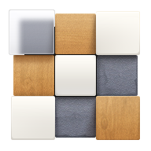

  

  <h1>Smartisan Launcher Maintained</h1>

  
<strong>锤子桌面复活</strong>

  
基于 <code>apktool</code> 直接维护 <code>com.smartisanos.home</code> 的反编译结果，修复新版 Android 上的安装、布局与主题兼容问题，并补齐旧桌面的可用主题资产。

  

    
    
    
    
  

> [!IMPORTANT]
> 本仓库是锤子桌面的非官方维护项目，与原厂无官方关联。仓库内容主要用于个人学习、兼容性分析和非商业研究。详细说明见 [NOTICE.md](NOTICE.md)。

## 项目亮点

- **动画精准分流**：精准区分“解锁屏幕”与“按主页键”，解决回桌面时误触发解锁动画的问题（通过 `isHomeKeyScrollToLeft` 标志位实现逻辑判定）。
- **Android 16 全面铺满**：彻底解决 Android 16 手势模式下底部 12px 的留缝问题，实现屏幕内容的真·全屏显示。
- **UI 布局深度纠偏**：修复主题详情页预览图垂直偏移问题，解除提示文字的挤压，1:1 还原经典居中比例。
- **自定义图标系统**：完整支持自定义图标上传与替换，补齐图标包管理的最后一块拼图。
- **锤子原味更新弹窗**：重绘并找回了经典的锤子风格在线更新界面，体验与原厂高度一致。
- **翻页动画性能优化**：修复翻页时可能出现的“闪一下回退”问题，确保动画立即生效且轨迹平滑。
- **独立生态**：更新服务器、主题下载完全迁移至私有 GitHub 仓库，不再依赖第三方，确保长期可用。

## 当前状态

- **[2026-05-17] 12 / 20 宫格迁移实验分支**：以 maintained 作为主工程，不再沿用 `original-port` 的固定坐标适配路线。当前已把 maintained 原有的 `9` / `16` 单板块模式复用为 `12` / `20` 语义：设置页文案改为十二宫格 / 二十宫格，底层格子计数改为 12 / 20，并同步 xhdpi / xxhdpi / xxxhdpi 的行列数和格子高度。12 / 20 主桌面均已在模拟器启动通过，文件夹能力仍在下一阶段处理。
- **[2026-04-20] v1.5.4.5.5.5.5.5.5.5.5 稳定增强版**：全量适配 Android 7.0+ 安装流程，修复下载完成后准备安装时的闪退；开放更新组件字段权限，根除 `IllegalAccessError`。
- **[2026-04-20] v1.5.4.5.5.5.5.5.5.5.5 稳定增强版**：新增“智能红点”纠错逻辑，确保更新后红点自动消失；修复检查更新时的 `IllegalAccessError` 闪退；修复最新版下无更新提示的问题。
- **[2026-04-19] v1.5.4.5.5.5.5.5.5.5.5 架构适配版**：实现 Android 16 底部留隙修复；完成“动画分流”判定逻辑；补齐自定义图标管理；全量中英文本地化支持。
- **主要兼容性修复记录**：集中在 [docs/compatibility-fixes.md](docs/compatibility-fixes.md)。
- **在线主题下载**：固定指向 `gh-proxy` + GitHub Release 的 `themes-v1`。
- **分身应用**：搜索页已可在主应用结果之外补充显示分身 / 双开应用结果，并支持直接打开，初步兼容多开环境。
- **壁纸自定义**：当设备安装毛玻璃或白雾主题时，设置页开放“桌面壁纸”入口，支持单独设置壁纸。

## 当前限制

- 桌面当前仍不支持直接在宫格中显示多开 / 分身应用图标。
- 当前不支持显示快捷方式图标。
- 当前不支持文件夹。后续迁移文件夹时，以 `original-port` 的文件夹数据、书架资源和打开态交互为参考，但必须接入 maintained 的自适应布局管线，避免重新引入 720p / 1080p 坐标错位问题。
- 当前不支持在桌面空白区域下拉直接展开系统通知栏。
- “桌面壁纸”设置当前仅对毛玻璃 / 白雾主题生效；其他主题仍使用包内置壁纸。

## 已实测环境

- Redmi Note 12 Turbo / Evolution X / Android 16
- Xiaomi Pad 5 Pro / HyperOS 1.0.2.0 / Android 13
- Android 12 ~ 15 Emulator / 各种导航模式

## 开发者说明

### 环境要求
- `apktool` / JDK / `adb` / Android SDK `build-tools`

### 常用命令
- 调试构建：`./tools/build_and_install.sh`
- 构建 Release：`sh ./tools/build_release.sh`
- 同步版本：修改 `tools/release.conf` 后运行构建脚本即可。

### 12 / 20 宫格迁移记录

当前分支：`codex/maintained-12-20-migration`。

迁移策略：

1. 保留 maintained 的应用包、设置页、图标替换、主题和自适应布局体系。
2. 不新建 `MODE_12` / `MODE_20`，先复用原有 `MODE_9` / `MODE_16` 的存储值和入口，降低设置页、数据库和重载逻辑的改造范围。
3. 将 `MODE_9` 的显示语义改为十二宫格：3 列 x 4 行，dock 仍保留 3 个。
4. 将 `MODE_16` 的显示语义改为二十宫格：4 列 x 5 行，dock 仍保留 4 个。
5. 非方形宫格必须区分 row / column。宽度计算使用 `page_cell_col_num`，高度计算使用 `page_cell_row_num`，点位数组索引使用 `rowIndex * columnCount + columnIndex`。

已完成：

- `smali/com/smartisanos/launcher/data/Constants.smali`
  - `cellCount()`：旧 9 / 16 模式分别返回 12 / 20。
  - `getCellNumByMode()`：旧 9 / 16 模式分别返回 12 / 20。
  - `createCellPoints()`：旧 9 模式改为 3x4，旧 16 模式改为 4x5。
  - `pageCellAdjustScaleForSpacing()`：非方形宫格的行列计算改为按列算宽、按行算高。
- `smali/com/smartisanos/launcher/view/PageWithRenderTarget.smali`
  - 批量渲染数组支持 12 / 20。
  - `getCurrentMatArray()` / `getCurrentModularColorArray()` 同时接受旧数量 9 / 16 和新数量 12 / 20。
  - 5 行二十宫格复用 `TextureBatch16Material` / `TwoTextureBatch16Material`，避免材质名为 null。
- `smali/com/smartisanos/launcher/view/BatchShadow.smali`
  - 阴影批量渲染数组支持 12 / 20。
  - 5 行二十宫格复用 16 系批量阴影材质。
- `smali/com/smartisanos/launcher/view/BatchBackground.smali`
  - 背景批量渲染数组支持 12 / 20。
  - 5 行二十宫格复用 `TextureBatch16PreColorMaterial`，并把背景纹理坐标数组容量扩到 20。
- `assets/Textures/1080p/9`
  - 放入 `original-port` 的 12 宫格资源。注意：内部存储值仍是 9，所以 12 宫格运行时仍查 `Textures/1080p/9`。
- `assets/Textures/1080p/16`
  - 放入 `original-port` 的 20 宫格资源。注意：内部存储值仍是 16，所以 20 宫格运行时仍查 `Textures/1080p/16`。
- `res/values-xhdpi-v4/integers.xml`
- `res/values-xxhdpi-v4/integers.xml`
- `res/values-xxxhdpi-v4/integers.xml`
  - `page_cell_row_num_9 = 4`
  - `page_cell_row_num_16 = 5`
  - 同步缩小 `cell_height_*`、`page_height_*` 和 `name_off_set_y_*`，避免 12 / 20 纵向溢出。
- `res/values-zh-rCN/strings.xml`
- `res/values/strings.xml`
  - 设置页和切换提示改为十二宫格 / 二十宫格。
- `smali/com/smartisanos/home/settings/view/SettingMainActivity.smali`
  - 设置上报文案从 `grid_type:9/16` 改为 `grid_type:12/20`。

本轮验证：

- `java -jar tools/apktool.jar b . -o build/unsigned.apk` 通过。
- `jarsigner` 签名生成 `build/signed.apk` 通过。
- `build/signed.apk` 大小约 42.8MB，仍保持 maintained 量级。
- 在 `emulator-5554` 上安装成功；若设备已安装旧 `com.smartisanos.launcher`，需要先卸载旧包，否则会因 `com.smartisanos.launcher.exportprovider` Provider 冲突安装失败。
- 12 宫格：模拟器启动通过，无 `cell poins size is not same` / `unknown row num and col num` 崩溃。
- 20 宫格：设置页可切换，确认后重载桌面通过，无 `MaterialDef.createMaterial(null)` 崩溃。

重要经验：

- maintained 的自适应能力来自它原本的 `LayoutProperty`、设置页、主题资源与图标替换体系。迁移时只应扩展它已有的模式管线，不要把 `original-port` 的固定分辨率坐标整体搬进来。
- 12 / 20 当前是复用旧 key，不是新增 mode。凡是资源路径、数据库、设置页日志仍看到 9 / 16，都要先判断它是不是 maintained 的兼容层，不能直接改成 12 / 20 路径。
- 20 宫格新增第 5 行后，所有按 `page_cell_row_num == 4` 才选择 16 系材质的代码，都需要改成 `page_cell_row_num >= 4` 或按总格数判断，否则会传 null 材质名导致 GL 线程崩溃。

下一阶段：

1. 继续验证十二宫格 / 二十宫格切换后的编辑页、dock、拖拽落点是否仍按自适应布局工作。
2. 如果编辑页验证通过，再迁移文件夹能力；文件夹先做数据结构和入口，再做锤子书架视觉，最后做打开动画和行内居中。
3. 文件夹迁移不能直接复制 `original-port` 的固定坐标，要把书架尺寸、图标点位和文字位置挂到 maintained 的 `LayoutProperty` / `Constants` 计算链路。

## 版权与免责声明

- 原始应用及相关商标、名称、资源和版权归原权利人所有。本仓库仅供个人学习与非商业研究之用。
